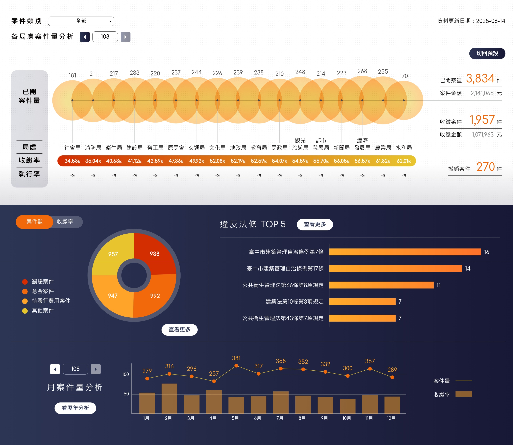

# 法制局儀錶板

## 系統介面展示



*主要功能包含各局處案件量視覺化、案件類型分析、違法條文統計及月度趨勢分析*

### UI 組件對應說明

| 介面區域 | 對應組件檔案 | 功能說明 |
|---------|-------------|----------|
| 🔵 **頂部氣泡圖表** | `BubbleLine.js` | 各局處案件量視覺化，圓形大小代表案件數量，下方顯示收繳率 |
| 🟠 **左下甜甜圈圖** | `TypeDonut.js` | 案件類型分布圓餅圖（罰鍰、稅務、特權行費用、其他） |
| 🟢 **右下橫條圖** | `LawTops.js` | 違反法條 TOP 5 排行榜 |
| 🟡 **底部月度圖表** | `YearChart.js` | 月案件量分析（折線圖+長條圖組合） |
| 📊 **右側統計數據** | `InfoSection.js`, `AvgDays.js` | 已開案量、金額、收繳、撤銷等統計資訊 |
| 🎛️ **頂部控制項** | `Dropdown.js`, `YearButton.js` | 案件類別篩選、年度切換等控制介面 |

**容器組件：** `containers/HomePage/index.js` 統籌管理所有子組件的資料流與狀態

## 使用技術架構

### 程式語言與核心技術
- **JavaScript (ES6+)** - 主要開發語言
- **React 16.9.0** - 前端框架
- **Redux + Redux-Saga** - 狀態管理與非同步處理

### 開發架構
- **Create React App** - 專案腳手架
- **React Hooks** - 組件邏輯管理
- **Styled Components** - CSS-in-JS 樣式解決方案
- **Styled System** - 設計系統與主題管理

### 資料視覺化工具
- **@vx/* 套件群** - 基於 D3.js 的 React 圖表庫
  - `@vx/axis` - 座標軸
  - `@vx/shape` - 幾何圖形
  - `@vx/scale` - 比例尺
  - `@vx/tooltip` - 提示框
- **D3.js 相關**
  - `d3-array` - 陣列處理
  - `d3-format` - 數值格式化
  - `d3-shape` - 形狀生成
- **Flubber** - 形狀變形動畫
- **@tweenjs/tween.js** - 補間動畫

### 其他工具與函式庫
- **Lodash** - 工具函式庫
- **Immutable.js** - 不可變資料結構
- **React-Modal** - 彈窗組件
- **Open Color** - 色彩系統

## 程式清單

### 核心目錄結構
```
src/
├── components/           # 通用 UI 組件
│   ├── Charts/          # 圖表基礎組件
│   │   ├── ChartBase.js        # 圖表基底類別
│   │   ├── TweenShape.js       # 動畫形狀組件
│   │   ├── PathInterpolation.js # 路徑插值
│   │   └── LineBreakText.js    # 多行文字處理
│   ├── ThemeProvider/   # 主題系統
│   │   ├── theme.js            # 主題配置（顏色、字體等）
│   │   └── global-styles.js    # 全域樣式
│   ├── Button.js        # 按鈕組件
│   ├── Modal.js         # 彈窗組件
│   ├── Dropdown.js      # 下拉選單
│   └── ...其他 UI 組件
├── containers/          # 頁面容器組件
│   ├── HomePage/        # 主視覺化頁面
│   │   ├── index.js            # 主頁面邏輯
│   │   ├── dataHandler.js      # 資料處理函式
│   │   ├── BubbleLine.js       # 氣泡線圖
│   │   ├── TypeDonut.js        # 類型甜甜圈圖
│   │   ├── YearChart.js        # 年度圖表
│   │   ├── PercentBars.js      # 百分比條形圖
│   │   ├── LawTops.js          # 排行榜圖表
│   │   └── YearByYear/         # 逐年分析子頁面
│   ├── SummaryPage/     # 摘要頁面
│   └── Layout/          # 版面配置組件
├── services/            # 服務層
│   └── api/            # API 相關
│       ├── config.js           # API 基礎設定
│       ├── sagas.js            # Redux-Saga 非同步處理
│       └── constants.js        # API 常數定義
├── stores/              # 狀態管理
│   ├── createStore.js          # Store 建立設定
│   └── reducers.js             # Reducer 合併
├── utils/               # 工具函式
└── hoc/                # 高階組件
```

### 主要檔案功能說明

**資料處理層**
- `dataHandler.js` - 處理 JSON 資料的轉換與計算邏輯
- `api/sagas.js` - 管理 API 呼叫與資料流

**視覺化組件**
- `BubbleLine.js` - 氣泡與折線複合圖表，展示趨勢與分佈
- `TypeDonut.js` - 甜甜圈圖，顯示類型占比
- `YearChart.js` - 年度統計圖表
- `PercentBars.js` - 百分比橫條圖
- `LawTops.js` - 排行榜視覺化

**UI 組件**
- `ThemeProvider/theme.js` - 統一管理顏色、字體、斷點設定
- `Modal.js` - 彈窗系統
- `Dropdown.js` - 篩選條件選單

## 程式編譯與封裝

### 本地開發
```bash
# 安裝依賴
npm install

# 啟動開發伺服器 (http://localhost:3000)
npm start

# 執行測試
npm test
```

### 生產環境編譯
```bash
# 建置生產版本到 build/ 目錄
npm run build

# 部署到 GitHub Pages
npm run deploy
```

### 建置產出物
- 編譯後的靜態檔案位於 `build/` 目錄
- 包含最佳化的 JavaScript、CSS 與資源檔案
- 支援 IE 11+ 及現代瀏覽器

## 程式更新與維護指南

### 1. 圖表讀取資料 (JSON) 的方法

**API 文檔與測試：**
- Swagger UI 文檔：https://relab.cc/law-api-test/doc/
  - 提供完整的 API 端點說明
  - 可線上測試 API 呼叫
  - 包含請求/回應格式範例
  - 支援 OAuth2 認證

**API 設定位置：**
- `src/services/api/config.js` - 修改 `API_BASE` 常數來變更資料來源
  ```javascript
  const BASE_URI = 'https://relab.cc/law-api-test/v2';
  export const API_BASE = BASE_URI;
  ```

**資料處理流程：**
1. API 呼叫在 `src/services/api/sagas.js` 中處理
2. 原始 JSON 資料經由 `src/containers/HomePage/dataHandler.js` 轉換
3. 關鍵轉換函式：
   - `mapData()` - 將原始資料映射為組件可用格式
   - `getBureauTotal()` - 計算各機關總計數據
   - `getTypes()` - 提取類型統計
   - `getMonthData()` - 整理月份資料

**JSON 資料格式要求：**
請參考 [Swagger UI 文檔](https://relab.cc/law-api-test/doc/) 中的 API 回應格式，該文檔提供：
- 最新的資料結構定義
- 完整的欄位說明
- 實際的回應範例
- 各端點的詳細參數

**注意：** 如 API 格式有異動，請以 Swagger 文檔為準，並相應更新 `dataHandler.js` 中的資料處理邏輯。

### 2. 圖表增減過濾條件的程式調動

**需要修改的檔案：**

**新增篩選條件時：**
1. `src/containers/HomePage/index.js` 
   - 在 state 中新增篩選狀態
   - 增加對應的 handler 函式

2. `src/containers/HomePage/dataHandler.js`
   - 修改資料處理函式以支援新的篩選邏輯
   - 更新 `getBureauTotal()`, `getTypes()`, `getMonthData()` 函式

3. 各圖表組件 (`BubbleLine.js`, `TypeDonut.js` 等)
   - 接收新的篩選參數 props
   - 調整圖表渲染邏輯

4. UI 控制組件
   - `src/components/Dropdown.js` - 新增篩選選項
   - `src/components/Toggler.js` - 新增切換控制

**範例：新增年份篩選**
```javascript
// 在 HomePage/index.js 中
const [yearFilter, setYearFilter] = useState('all');

// 在 dataHandler.js 中
export const filterByYear = (data, year) => {
  if (year === 'all') return data;
  return data.filter(d => d.year === year);
};
```

### 3. 圖表顏色修改處理

**主要顏色配置檔案：**
- `src/components/ThemeProvider/theme.js` - 統一色彩系統

**顏色修改方式：**

**1. 修改主題色彩：**
```javascript
// 在 theme.js 中修改 colors 物件
export default {
  colors: {
    orange: '#新的橘色值',
    darkBlue: '#新的深藍色值',
    spectrum: [
      '#色彩1',
      '#色彩2',
      // ... 更多色彩
    ],
    // 其他顏色定義
  }
}
```

**2. 個別圖表顏色：**

**TypeDonut.js (甜甜圈圖)：**
- 修改 legends 陣列中的 `color` 屬性
- 顏色透過 `getColorByName` 物件映射

**BubbleLine.js (氣泡線圖)：**
- 漸層色彩定義在 `<LinearGradient>` 和 `<RadialGradient>` 組件中
- 修改 `from` 和 `to` 屬性值

**其他圖表組件：**
- 直接在 JSX 中修改 `fill` 或 `stroke` 屬性
- 使用 `theme.colors.顏色名稱` 引用主題色彩

**3. 條件式顏色：**
```javascript
// 範例：根據數值動態設定顏色
const getColor = (value) => {
  if (value > 100) return theme.colors.orange;
  if (value > 50) return theme.colors.lightOrange;
  return theme.colors.gray;
};
```
